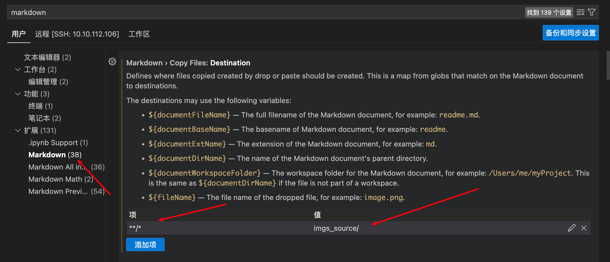
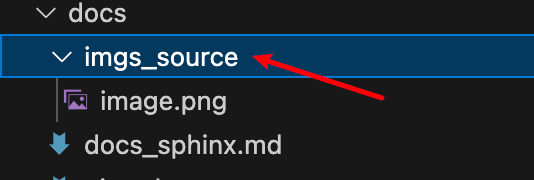

# Sphinx
仓库使用Sphinx管理文档，这里的使用主要参考博文
1. https://blog.csdn.net/hhy321/article/details/131150447，其中包含网络部署、主题安装等。
2. https://www.sphinx-doc.org/en/master/usage/quickstart.html，官方的简介。
3. https://zhuanlan.zhihu.com/p/102208548，知乎参考

## 1. 安装
**python环境安装：**
``` python
pip install sphinx sphinx_rtd_theme sphinx_markdown_tables recommonmark
# 其中sphinx_rtd_theme为常见主题，sphinx_markdown_tables为md表哥，recommonmark使用md文件。
```
**vscode插件安装：**
```
Markdown All in One
Markdown Preview Enhanced
```
**vscode图片复制设置：**
vscode设置中搜索markdown，然后添加项，项（key）中`**/*`,数值上写期望的路径。

设置完毕后，复制粘贴板的图片，会保存在markdown文件同级目录。


## 2. sphinx初级使用
1. 首先创建一个文件夹，执行`sphinx-quickstart`,依次输入项目名称等，后续还可以在source/conf.py中设置。实行完毕，得到以下目录：
```
You have two options for placing the build directory for Sphinx output.
Either, you use a directory "_build" within the root path, or you separate
"source" and "build" directories within the root path.
> Separate source and build directories (y/n) [n]: y

The project name will occur in several places in the built documentation.
> Project name: cvcv手册
> Author name(s): tenstep
> Project release []: 

If the documents are to be written in a language other than English,
you can select a language here by its language code. Sphinx will then
translate text that it generates into that language.

For a list of supported codes, see
https://www.sphinx-doc.org/en/master/usage/configuration.html#confval-language.
> Project language [en]: zh_CN


|-- build       <--------  生成文件的输出目录
|-- make.bat    <--------  Windows 命令行中编译用的脚本
|-- Makefile    <--------  编译脚本，make命令编译时用
`-- source      <--------  文档源文件
    |-- conf.py     <--------  进行 Sphinx 的配置，如主题配置等
    |-- index.rst   <--------  文档项目起始文件，用于配置文档的显示结构
    |-- _static     <--------  静态文件目录, 比如图片等
    `-- _templates  <--------  模板目录
```
2. 然后make html。
```
如果中间报错，需要回退request。
Extension error:
Could not import extension sphinx.builders.linkcheck (exception: urllib3 v2.0 only supports OpenSSL 1.1.1+, currently the 'ssl' module is compiled with 'OpenSSL 1.0.2k-fips  26 Jan 2017'. See: https://github.com/urllib3/urllib3/issues/2168)
make: *** [html] Error 2

解决方案，回退request版本，pip3 install requests==2.29.0
```

3. 修改主题、markdown格式匹配
```
source/conf.py中修改如下

# exclude_patterns = []
extensions = ['recommonmark','sphinx_markdown_tables']


# -- Options for HTML output -------------------------------------------------

# The theme to use for HTML and HTML Help pages.  See the documentation for
# a list of builtin themes.
#
# html_theme = 'alabaster'
html_theme = 'sphinx_rtd_theme'
```

4. 发布到网络
```
# 发布, port设置一个，host设置为0.0.0.0（如果需要远程）（尚未验证）
sphinx-autobuild source build/html --port 3223 #--host 0.0.0.0
```