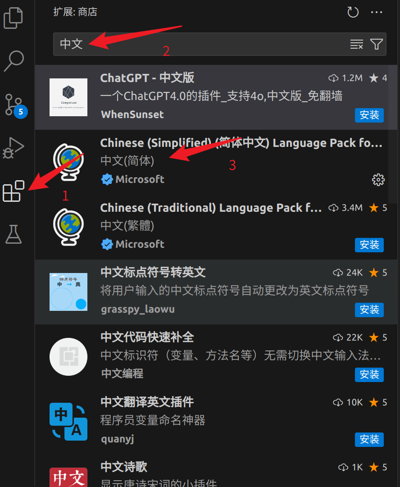

- [1. 安装vscode](#1-安装vscode)
  - [1.1 window](#11-window)
  - [1.2 mac](#12-mac)
- [2. 配置](#2-配置)
  - [2.1 配置语言](#21-配置语言)
  - [2.2 常用插件](#22-常用插件)
  - [2.3 大模型连接](#23-大模型连接)
- [3. 开发机使用](#3-开发机使用)
  - [3.1 远程插件](#31-远程插件)
  - [3.2 免密码登陆](#32-免密码登陆)

# 1. 安装vscode
## 1.1 window

## 1.2 mac

# 2. 配置
## 2.1 配置语言


## 2.2 常用插件
Markdown All in One

## 2.3 大模型连接

# 3. 开发机使用
## 3.1 远程插件
## 3.2 免密码登陆
简单版本
```bash
# 笔记本操作
ssh-keygen -t rsa
ssh-copy-id user@host_ip（远程ip）
# 案例
ssh-keygen -t rsa
ssh-copy-id yangkun.zhu@xxxip
# 测试
ssh yangkun.zhu@xxxip 不需要密码了，就是设置成功了
```

